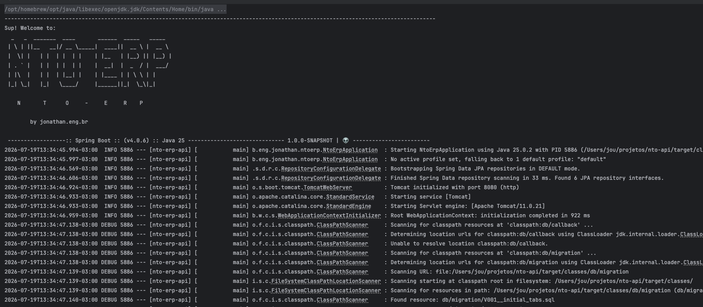

# 🚀 NTO-ERP API

This GitHub repository contains the source code for NTO-ERP's API, a comprehensive and customizable business management system designed specifically for the unique operational needs of **Cafeterias and Bistros**.

## 📋 What is NTO-ERP?

NTO-ERP is a micro-ERP designed for lightweight and focused business management, offering a powerful alternative to traditional, complex enterprise resource planning systems.

## ✨ Key Features

NTO-ERP offers a powerful suite of features to manage various aspects of your business, including:

*   **Sales and Invoicing:** Create quotes, sales orders, invoices, track cash flow, and generate sales reports.
*   **Inventory:** Control product inventory, perform stock ins and outs, set reorder points, and monitor stock levels.
*   **Purchasing:** Create purchase requisitions, place purchase orders, track product receipts, and manage suppliers.
*   **Finance:** Control accounts payable and receivable, perform bank reconciliations, monitor cash flow, and generate financial reports.
*   **Customers and Contacts:** Store customer and contact information, manage leads, track interaction history, and run marketing campaigns.
*   **Reports:** Generate customized reports on sales, inventory, finance, customers, and other areas of your business.

## 🛠️ Technology Stack

| Layer | Technology                                    |
| :--- |:----------------------------------------------|
| **Language** | Java 25                                       |
| **Framework** | Spring Ecosystem (Boot 4, Data JPA, Security) |
| **Database** | PostgreSQL                                    |
| **Migrations** | Flyway                                        |
| **API Docs** | springdoc / OpenAPI                           |
| **Observability** | Micrometer Tracing                            |
| **Deployment** | VPS using Docker (Containers)                            |

---

## 🚀 Getting Started

To install and run NTO-ERP on your local environment, follow the step-by-step instructions in the [INSTALL.md](INSTALL.md) file.

## 🤝 Contributing

The community is welcome to contribute to the development of NTO-ERP. To learn how to contribute, please read the [CONTRIBUTING.md](CONTRIBUTING.md) file.

## 📄 Documentation & Support

*   **Full Documentation:** Comprehensive documentation for NTO-ERP is available at [jonathan.eng.br](https://jonathan.eng.br)
*   **Community Forum:** For support and discussions, join us at [jonathan.eng.br Forum](https://jonathan.eng.br)

---

## 📝 License

NTO-ERP is licensed under the **Apache 2.0 License**. This license grants users extensive freedom to use, modify, and distribute the software, including for commercial purposes.

> **Embrace Efficient Business Management with NTO-ERP!**
> *Jonathan Nascimento — NTO-ERP Creator*